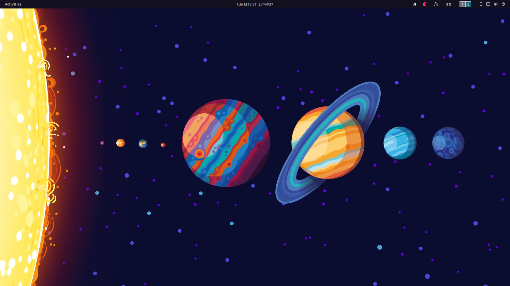
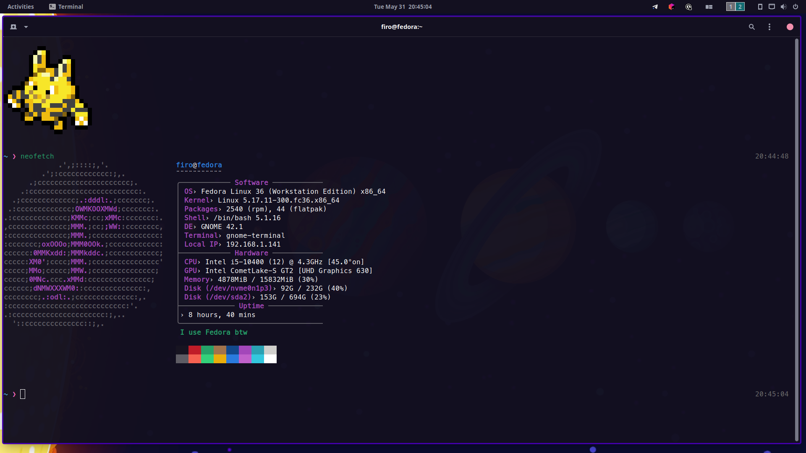
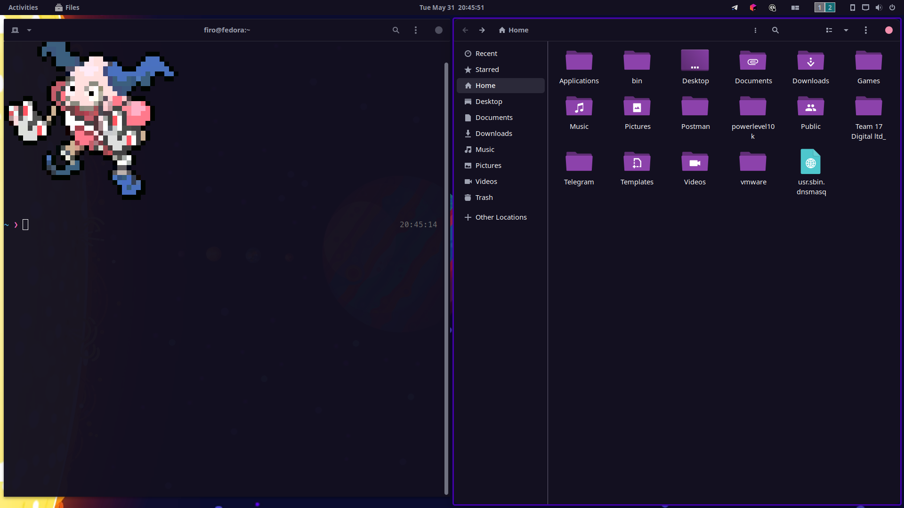
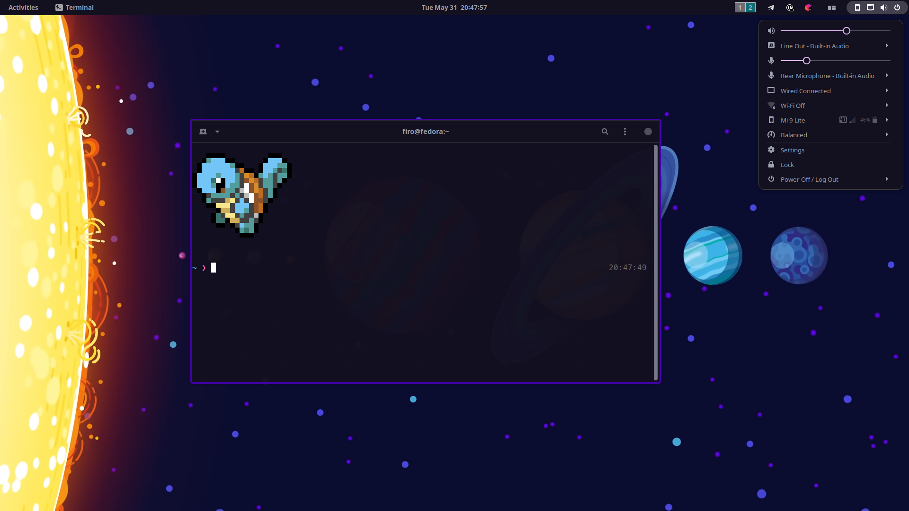

# My Fedora 36 Theme

This is my personal *Fedora 36* theme. If you want to use this theme, I **DO NOT** take any resposibility if anything breaks during the process. **This is not an installation guide!**

## 🖼️ Gallery







## 🎁 Table of Contents

| Name                                                                                            | Type                                                  | Description                                                                                                                       |
| ----------------------------------------------------------------------------------------------- | ----------------------------------------------------- | --------------------------------------------------------------------------------------------------------------------------------- |
| [Blur my Shell](https://github.com/aunetx/blur-my-shell)                                        | Extension [(config)](https://imgur.com/a/UdErz8d)     | Adds blur effect to the shell                                                                                                     |
| [Improved Workspace Indicator](https://github.com/MichaelAquilina/improved-workspace-indicator) | Extension [(config)](https://i.imgur.com/hPKZqI5.png) | Adds a workspace indicator into the panel                                                                                         |
| [App Indicator](https://github.com/ubuntu/gnome-shell-extension-appindicator)                   | Extension                                             | Adds tray icons to the shell                                                                                                      |
| [Pop Shell](https://github.com/pop-os/shell) with tiling and active hint enabled                | Extension [(config)](https://i.imgur.com/DNual0S.png) | Adds elements from the Pop!_OS Shell                                                                                              |
| [Catppuccin](https://github.com/catppuccin/catppuccin) Mocha                                    | Theme                                                 | Theme used in this personalization *(used in firefox, gtk, gnome-terminal, youtube, github, telegram, micro, and jetbrains IDEs)* |
| [Catppuccin Mauve Cursors](https://github.com/catppuccin/cursors)                               | Cursor                                                |                                                                                                                                   |
| [Flat Remix Violet Dark](https://www.gnome-look.org/p/1013030/)                                 | Icon Pack                                             |                                                                                                                                   |
| [Neofetch](https://github.com/dylanaraps/neofetch)                                              | Application                                           | Shows information about your system                                                                                               |
| [Pokemon Colorscripts](https://github.com/nuke-dash/pokemon-colorscripts-mac)                   | Application                                           | Prints a cute pokemon (used inside zshrc)                                                                                         |
| ZSH                                                                                             | Shell                                                 | Shell used in this personalization (default was bash)                                                                             |


## ⚙️ Using configs

First of all, clone this repo with the commands below

```bash
$ git clone https://github.com/ImOnlyFire/fedora-theme
$ cd fedora-theme
```

To use the `neofetch` config, you need to copy the config from the repo to the local neofetch config (make sure to install neofetch first!)

```bash
$ cp configs/neofetch.conf ~/.config/neofetch/config.conf
```

To use the `pokemon-colorscripts` application on shell startup, you need to add this to the `~/.zshrc` file (make sure to install `ZSH` and `pokemon-colorscript` first!)

```bash
$ echo "pokemon-colorscripts -r --no-title" | tee -a ~/.zshrc
```

To install theme, icon packs, and the other stuff, just look the documentation for each content


